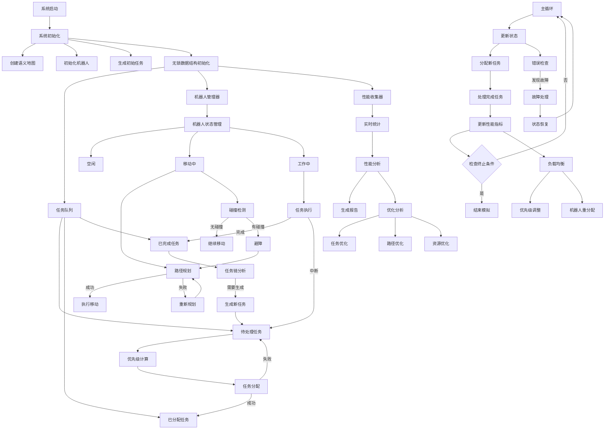
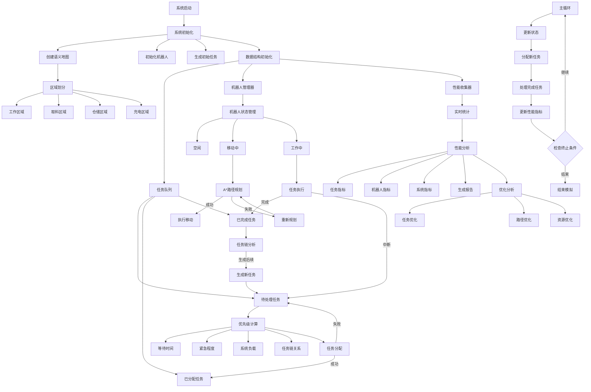
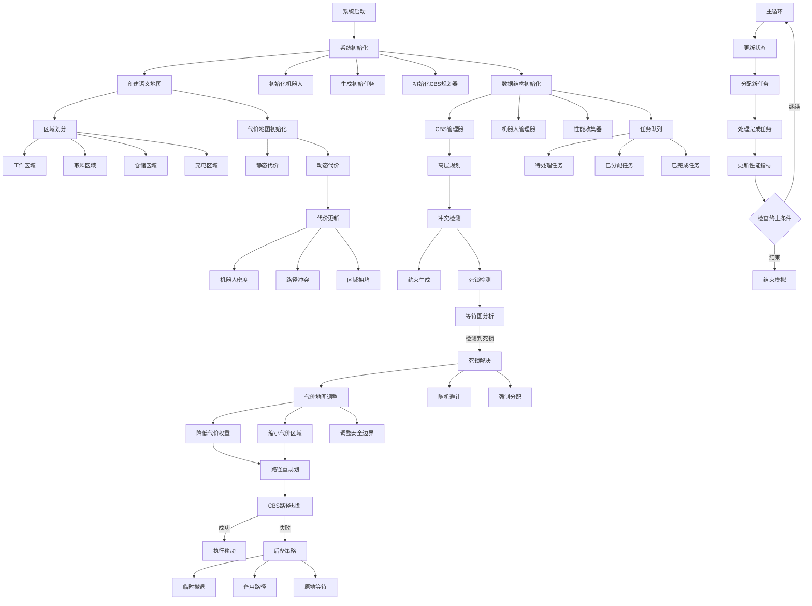
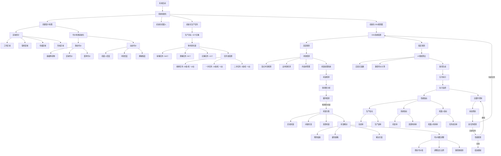
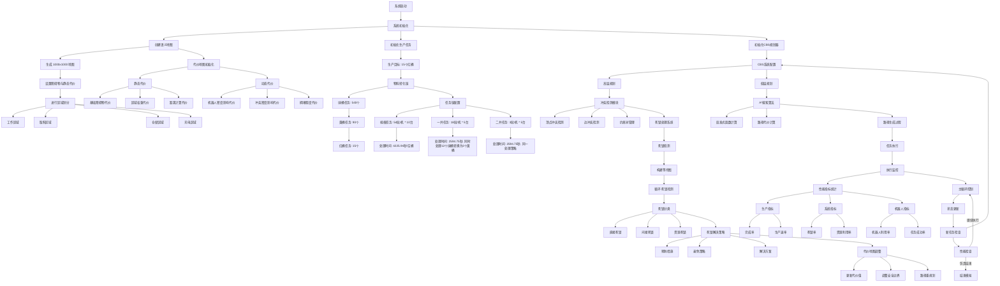

# 无锁

现在流程图更清晰了。您想从哪个组件开始实现？建议按以下顺序：

1. 核心数据结构（任务队列、机器人管理器等基础组件）
2. 任务管理系统（任务生成、分配、跟踪）
3. 机器人控制系统（状态管理、路径规划、避障）
4. 性能监控系统（数据收集、分析、报告）

# 有锁

这个完整的流程图包含了：

1. 主要流程：从启动到结束的完整流程
2. 初始化流程：系统启动时的设置过程
3. 模拟循环：主要的运行循环
4. 任务管理：任务的生命周期和优先级管理
5. 机器人控制：机器人的状态管理和路径规划
6. 性能监控：系统性能的监控和分析
7. 数据流：系统中的数据流动

# CBS

我来重新设计一个完整的系统流程图，整合之前的优秀设计和新的CBS算法：

这个系统流程图整合了：

1. CBS路径规划系统：

- 基于CBS的多机器人路径规划
- 冲突检测和解决机制
- 安全约束管理

1. 死锁处理策略：

- 通过随机避让解决死锁
- 设置临时避让区
- 强制分配机制

1. 任务管理优化：

- 任务链优化
- 动态优先级调整
- 多策略任务分配

1. 性能监控和优化：

- 实时性能监控
- 自适应策略调整
- 资源负载均衡

1. 异常处理机制：

- 状态备份和恢复
- 紧急处理流程
- 系统容错

需要我详细说明某个具体模块的实现吗？我可以为任何模块提供详细的代码实现。

另外，对于死锁问题的具体解决方案，我建议结合CBS和随机避让策略：

1. 首先使用CBS进行全局路径规划
2. 当检测到死锁时，使用随机避让策略
3. 如果随机避让失败，则启用强制分配机制

这样可以在保证效率的同时提高系统的鲁棒性。需要我详细展开这部分的实现吗？

您说得对，我重新整合之前的CBS和死锁部分，生成一个更完整的系统流程图：

这个完整流程图包含了：

1. CBS路径规划完整流程
   - 高层规划：冲突检测、约束树管理
   - 低层规划：A*搜索、启发式函数
   - 代价计算和路径构建
2. 死锁处理系统
   - 检测机制：等待图、循环检测
   - 死锁类型：直接、间接、资源死锁
   - 解决策略：预防、避免、解决
3. 生产任务链
   - 物料转化：540绿桶 -> 90黄桶 -> 15红桶
   - 处理时间：梳棉4225.94s、并条2594.75s
   - 任务批次：梳棉54批、一并18批、二并3批
4. 完整的监控系统
   - 生产指标
   - 系统指标
   - 机器人指标

需要我开始代码实现吗？我会基于这个详细流程图，确保每个组件都得到完整实现。

# 实际代码设计

好，从现在开始，进行实际场景设计，接下来是实际代码的设计，这个代码会很长结合之前所有代码：
实际代码设计
1.固定场景，为1000*1000大小工厂，从左到右定义代运区（梳棉区待装填，梳棉区已装填；一并...二并...粗纱原料区--空桶集合区），这个需要设计，每个机器一个区域，

2.机器人数量：10

3.生产任务链：

- 初始，粗纱机旁边有540个空桶
- 物料转化：540空桶->540绿桶 -> 90黄桶 -> 15红桶
- 流程：空桶区--（梳棉）待装填区（有容量上限）-（梳棉）已装填区---并条待装填区---并条已装填区--二并同理--粗纱原料区
- 处理时间：梳棉4225.94s、并条2594.75s（无论1，2并）
- 10台梳棉机，一并5台，二并5台，粗纱机5台
- 任务批次：梳棉机一台一次可以处理一个空桶为一个绿桶，并条机一台一次可以处理12个绿桶转化为两个黄桶（一个机器可以同时运作2*6个绿桶）；二并同理，黄-红；最终将15个红桶运到5台机器，每台三个即可

4.生产任务与性能监控

-生产链：上面有说，6：1；6：1，处理时间固定，使用全局模拟时间（类似步数的结构，你就可以理解为步数，但是你要定义好每步的时间）

模拟直到红桶任务达到15个或达到最大步数/时间

5.测试用例
仿真，并且用上实际地图，这种具体的；输出各项指标，并输出计算的过程

地图可视化，以便查验

每个机器人完成的任务和总运动时长，路径长

其他同理，测试中已有

下面给出一个使用 Mermaid TB 绘制的完整流程图，该流程图涵盖了实际场景的系统设计（固定 1000×1000 工厂、区域划分、生产任务链、机器与设备配置、路径规划（CBS+A*）、死锁处理、生产任务执行、性能监控与仿真输出等），不涉及充电桩部分。

请参考下面的流程图代码：

### 流程图说明

1. **系统启动与初始化**
   - 从系统启动开始，依次进行工厂地图（1000×1000）的初始化、机器人（10台）、生产任务链、路径规划（采用CBS和A*）、死锁处理以及性能监控模块的初始化。
2. **地图与区域划分**
   - 地图划分为多个区域，从左到右依次包含：空桶集合区、梳棉区待装填区、梳棉区已装填区、并条（1并）待装填区、并条已装填区、二并待装填区、二并已装填区以及粗纱原料区。
3. **生产任务链与设备配置**
   - 初始时，540个空桶放在空桶集合区。经过物料转化链，依次转换为540绿桶、90黄桶，最终15个红桶作为成品。
   - 配置各生产设备：10台梳棉机、5台一并机、5台二并机、5台粗纱机，分别对应固定的处理时间和处理批次要求。
4. **路径规划系统**
   - CBS系统分为高层（冲突检测、约束树管理）和低层（基于A*的路径搜索、启发式计算和路径生成），生成各机器人行进的最优路径。
5. **死锁处理系统**
   - 构建机器人资源等待图，检测循环（死锁）；对检测到的死锁进行分类（直接、间接或资源死锁），并根据策略调整代价地图和重新规划路径。
6. **生产任务执行与监控主循环**
   - 主循环中依次更新生产任务链（物料的批次转换）、更新机器人任务分配（通过CBS获得新路径）、机器人沿路径移动、设备按固定处理时间完成加工、死锁检测、以及性能指标更新。
   - 循环判断：当红桶产量达到15个或达到最大仿真时间时结束仿真。
7. **输出与可视化**
   - 仿真结束后输出各项结果（区域任务数据、各机器人完成任务统计、运动时长、路径总长等）。
   - 同时利用地图可视化显示区域分布、机器人运动轨迹，并展示各项性能指标（完成率、生产速率、效率等）。

该流程图为后续实际代码设计提供了整体思路和结构指导，后续可以基于此流程图实现系统的各个模块。