# 充电

好的，我用TB（Top to Bottom）模式重新绘制流程图，这样可以更清晰地从上到下展示测试流程。

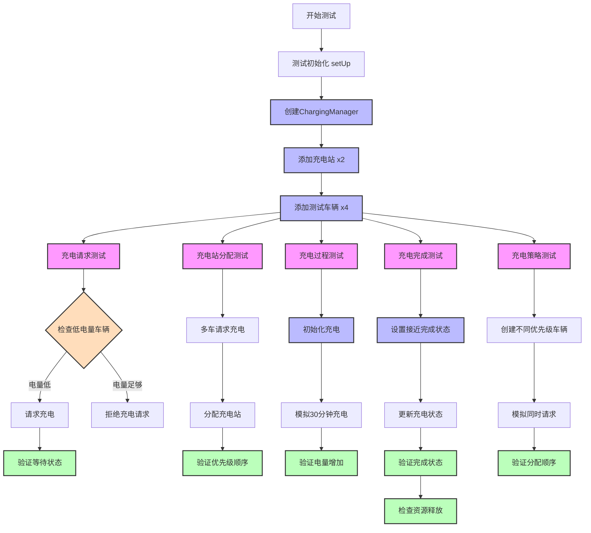

流程图主要分为六个部分：

1. 初始化部分：
   - 创建管理器
   - 添加充电站
   - 添加测试车辆
2. 充电请求测试：
   - 检查车辆电量
   - 处理充电请求
   - 验证状态变化
3. 充电站分配测试：
   - 处理多车请求
   - 执行分配逻辑
   - 验证优先级
4. 充电过程测试：
   - 初始化充电
   - 模拟充电过程
   - 验证电量变化
5. 充电完成测试：
   - 设置测试状态
   - 验证完成逻辑
   - 检查资源释放
6. 充电策略测试：
   - 创建测试车辆
   - 模拟并发请求
   - 验证优先级排序

颜色说明：

- 粉色: 主要测试用例
- 蓝色: 处理过程
- 绿色: 验证步骤
- 橙色: 决策节点

这样的自上而下的布局更容易理解测试的执行顺序和层次关系。需要我详细解释某个具体的测试流程吗？

# 冲突检测

我用mermaid来绘制多机器人冲突检测测试的流程图：

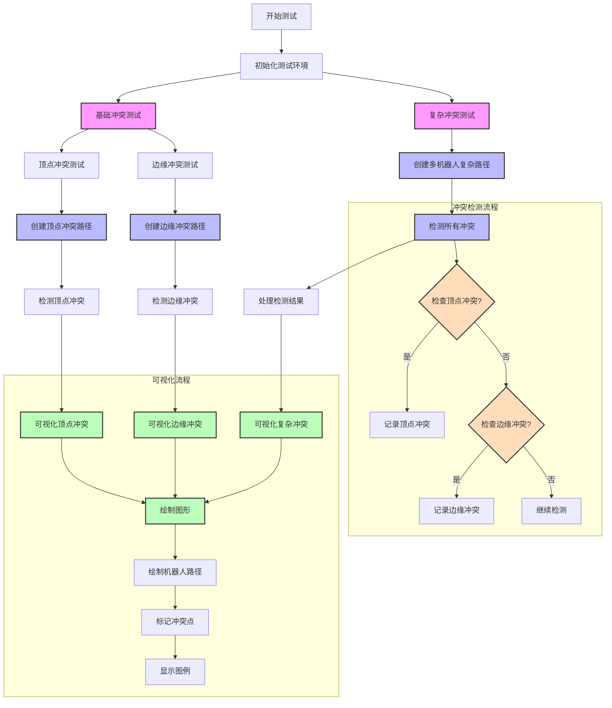

这个流程图展示了测试代码的主要组成部分：

1. 测试初始化
   - 环境设置
   - 基础类定义（Position, Conflict）
2. 基础冲突测试
   - 顶点冲突测试路径创建和检测
   - 边缘冲突测试路径创建和检测
   - 各类冲突的可视化
3. 复杂冲突测试
   - 创建多机器人复杂路径
   - 综合冲突检测
   - 结果处理和可视化
4. 冲突检测子流程
   - 顶点冲突检查
   - 边缘冲突检查
   - 冲突记录
5. 可视化子流程
   - 路径绘制
   - 冲突点标记
   - 图例显示

颜色说明：

- 粉色：主要测试用例
- 蓝色：处理流程
- 绿色：可视化过程
- 橙色：决策节点

这个流程图清晰地展示了测试代码的结构和执行流程。需要我对某个具体部分做更详细的解释吗？

# 死锁测试

我来创建一个包含测试内容的详细流程图，并列出具体的测试分析：

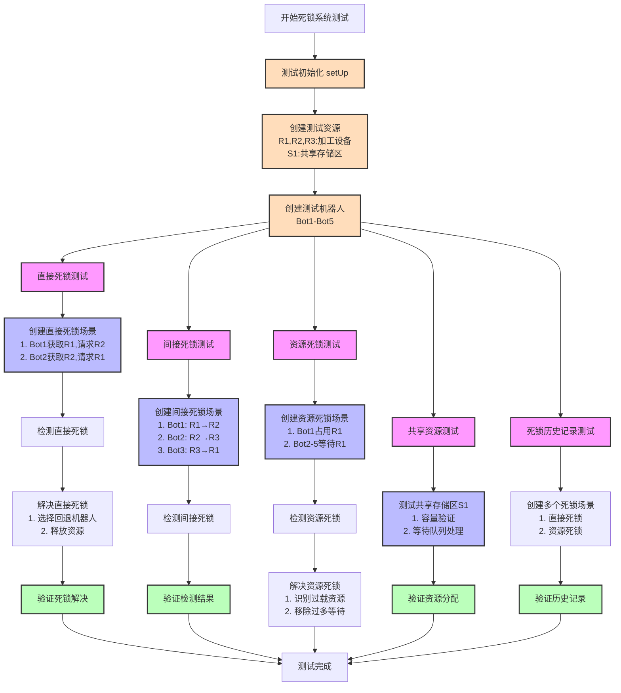

测试内容详细分析：

1. 直接死锁测试 (test_direct_deadlock)
   - 场景：两个机器人互相请求对方持有的资源
   - 测试点：
     - 死锁检测准确性
     - 死锁解决策略有效性
     - 解决后状态验证
2. 间接死锁测试 (test_indirect_deadlock)
   - 场景：三个或更多机器人形成循环等待
   - 测试点：
     - 复杂等待关系检测
     - 涉及机器人识别准确性
     - 等待图构建正确性
3. 资源死锁测试 (test_resource_deadlock)
   - 场景：多个机器人等待同一资源
   - 测试点：
     - 资源过载检测
     - 等待队列管理
     - 资源分配策略
4. 共享资源测试 (test_shared_resource)
   - 场景：测试容量为2的共享存储区
   - 测试点：
     - 并发访问控制
     - 容量限制遵守
     - 等待队列处理
     - 资源释放后的重分配
5. 死锁历史记录测试 (test_deadlock_history)
   - 场景：创建并解决多个不同类型的死锁
   - 测试点：
     - 死锁类型记录
     - 涉及机器人记录
     - 历史记录完整性

关键验证点：

- 死锁检测的准确性
- 解决策略的有效性
- 资源分配的公平性
- 系统恢复的可靠性
- 历史记录的完整性

这个测试套件综合验证了死锁检测、预防和解决的各个方面，确保系统能够正确处理各种死锁场景。需要我对某个具体测试场景做更详细的解释吗？

# 路径规划和代价地图

我来创建路径规划与代价地图系统的测试流程图及其详细测试内容：

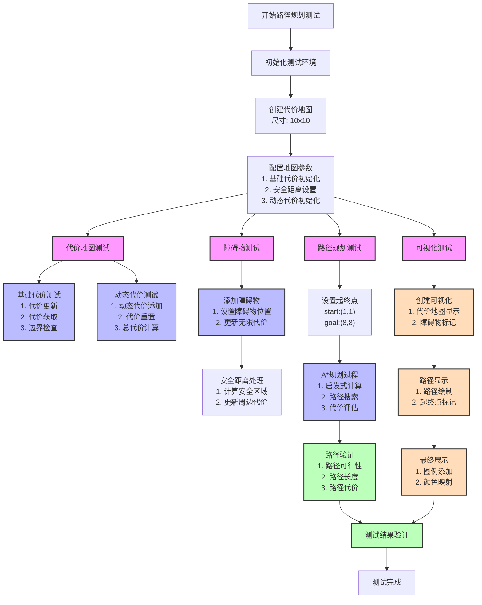

详细测试内容分析：

1. 代价地图测试 (CostMap Testing)
   - 基础代价管理：
     - 初始化代价矩阵
     - 更新单点代价
     - 验证代价边界
   - 动态代价管理：
     - 动态代价叠加
     - 代价重置功能
     - 总代价计算准确性
2. 障碍物测试 (Obstacle Testing)
   - 障碍物添加：
     - 设置障碍物位置
     - 验证无限代价设置
   - 安全距离处理：
     - 安全区域计算
     - 周边代价衰减
     - 多障碍物交互
3. 路径规划测试 (Path Planning Testing)
   - A*算法实现：
     - 启发式函数验证
     - 路径搜索过程
     - 最优路径选择
   - 路径质量评估：
     - 路径连续性
     - 避障有效性
     - 路径平滑度
4. 可视化测试 (Visualization Testing)
   - 代价地图显示：
     - 代价值颜色映射
     - 障碍物标记
   - 路径可视化：
     - 路径线条绘制
     - 起终点标记
     - 图例和标题

关键验证点：

- 代价计算的准确性
- 路径规划的有效性
- 安全距离的合理性
- 可视化的清晰度
- 系统整体性能

这个测试框架全面覆盖了路径规划系统的各个组件，确保系统能够正确处理各种规划场景。需要我对某个具体测试模块做更详细的解释吗？

# 生产流程测试

我来创建生产系统性能测试的流程图：

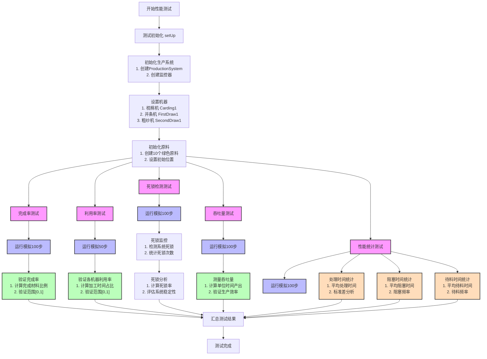

详细测试内容分析：

1. 完成率测试 (Completion Rate Test)
   - 运行环境：
     - 100步模拟
     - 10个初始材料
   - 测试指标：
     - 材料完成比例
     - 验证值范围
2. 利用率测试 (Utilization Rate Test)
   - 运行环境：
     - 50步模拟
     - 所有机器监控
   - 测试指标：
     - 机器工作时间比例
     - 各状态时间统计
3. 死锁检测测试 (Deadlock Detection Test)
   - 运行环境：
     - 100步模拟
     - 连续状态监控
   - 测试指标：
     - 死锁发生次数
     - 死锁发生率
     - 系统恢复能力
4. 吞吐量测试 (Throughput Test)
   - 运行环境：
     - 100步模拟
     - 产出计数
   - 测试指标：
     - 单位时间产出
     - 生产效率评估
5. 性能统计测试 (Performance Statistics Test)
   - 处理时间分析：
     - 平均处理时间
     - 处理时间波动
   - 阻塞分析：
     - 阻塞频率
     - 平均阻塞时长
   - 待料分析：
     - 待料频率
     - 平均待料时长

关键验证点：

- 系统稳定性
- 生产效率
- 资源利用率
- 瓶颈识别
- 异常处理能力

这个测试框架全面评估了生产系统的性能指标，帮助识别系统瓶颈和优化方向。需要我对某个具体测试模块做更详细的解释吗？

# 生产线系统测试

我来创建生产线系统测试的流程图：

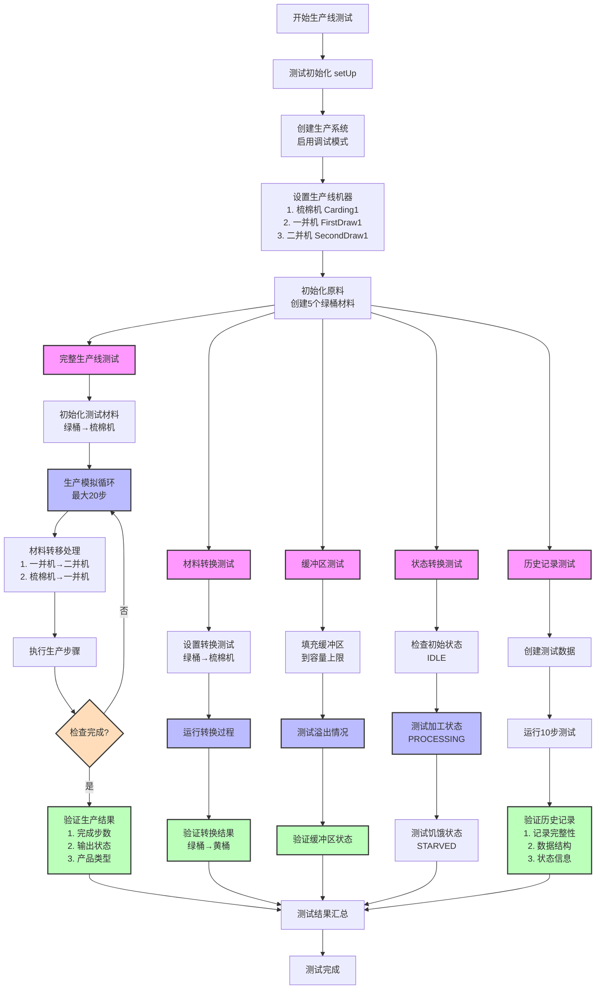

测试内容详细分析：

1. 完整生产线测试 (test_production_line)
   - 生产流程：
     - 绿桶→梳棉机→黄桶
     - 黄桶→一并机→红桶
     - 红桶→二并机→空桶
   - 验证点：
     - 生产完成时间
     - 产品转换正确性
     - 缓冲区管理
2. 材料转换测试 (test_material_transformation)
   - 转换流程：
     - 材料类型转换验证
     - 加工时间控制
   - 验证点：
     - 转换结果正确性
     - 状态变更准确性
3. 缓冲区测试 (test_buffer_capacity)
   - 测试场景：
     - 正常容量测试
     - 超出容量处理
   - 验证点：
     - 容量限制执行
     - 溢出处理机制
4. 状态转换测试 (test_machine_states)
   - 状态流转：
     - IDLE → PROCESSING
     - PROCESSING → IDLE
     - IDLE → STARVED
   - 验证点：
     - 状态转换正确性
     - 转换条件满足
5. 历史记录测试 (test_production_history)
   - 记录内容：
     - 时间戳记录
     - 机器状态记录
     - 缓冲区状态
   - 验证点：
     - 记录完整性
     - 数据结构正确
     - 状态信息准确

关键验证要点：

- 生产流程完整性
- 材料转换准确性
- 缓冲区管理有效性
- 状态转换正确性
- 历史记录可靠性

这个测试框架全面验证了生产线系统的各个功能组件和整体运行情况。需要我对某个具体测试场景做更详细的解释吗？

# 任务检测和转化系统

我来创建任务状态转换与执行监控测试的流程图：

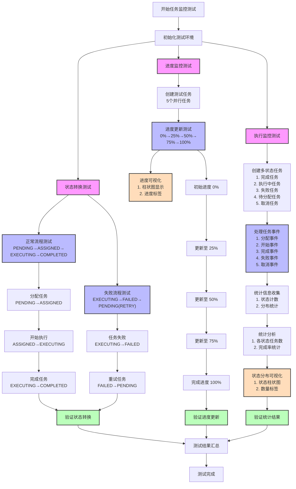

测试内容详细分析：

1. 状态转换测试 (test_state_transitions)
   - 正常流程：
     - PENDING → ASSIGNED → EXECUTING → COMPLETED
     - 验证状态转换正确性
     - 检查转换结果
   - 失败流程：
     - EXECUTING → FAILED → PENDING (通过RETRY)
     - 验证异常处理
     - 检查恢复机制
2. 进度监控测试 (test_progress_monitoring)
   - 测试场景：
     - 创建5个并行任务
     - 模拟进度更新
     - 进度可视化
   - 验证点：
     - 进度更新准确性
     - 边界值处理
     - 可视化效果
3. 执行监控测试 (test_execution_monitoring)
   - 测试内容：
     - 多状态任务创建
     - 事件处理
     - 状态统计
   - 验证点：
     - 状态分布统计
     - 完成率计算
     - 可视化展示

关键验证要点：

- 状态转换的合法性
- 进度更新的准确性
- 异常处理的有效性
- 统计数据的完整性
- 可视化展示的清晰性

这个测试框架全面验证了任务执行监控系统的各个功能组件和整体运行情况。需要我对某个具体测试场景做更详细的解释吗？

# 任务链系统

我来创建任务优先级和任务链测试的流程图：

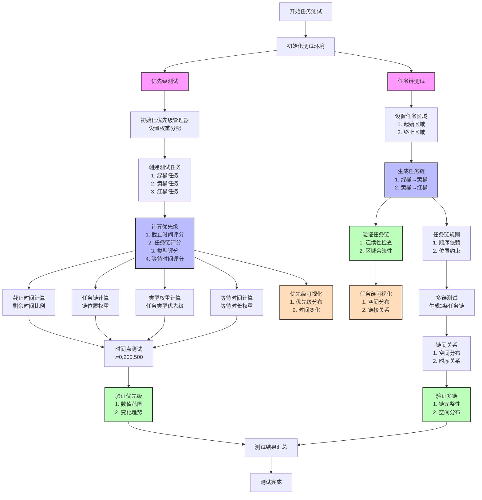

测试内容详细分析：

1. 优先级测试 (test_task_priority)
   - 基础计算：
     - 截止时间评分 (30%)
     - 任务链评分 (30%)
     - 任务类型评分 (20%)
     - 等待时间评分 (20%)
   - 验证点：
     - 优先级计算准确性
     - 时间变化影响
     - 权重分配合理性
2. 任务链测试 (test_production_chain)
   - 链生成：
     - 绿桶→黄桶→红桶序列
     - 区域约束遵守
     - 位置合理性
   - 验证点：
     - 任务连续性
     - 空间分布合理性
     - 多链交互关系
3. 空间布局测试
   - 区域定义：
     - 绿桶区域 (10,10)-(20,20)
     - 黄桶区域 (30,30)-(40,40)
     - 红桶区域 (50,50)-(60,60)
   - 验证点：
     - 区域边界处理
     - 路径可行性
     - 空间利用效率
4. 可视化验证
   - 任务分布：
     - 起点终点标记
     - 任务路径显示
     - 链接关系展示
   - 分析内容：
     - 空间分布合理性
     - 任务链清晰度
     - 视觉直观性

关键验证要点：

- 优先级计算准确性
- 任务链完整性
- 空间约束满足度
- 可视化效果清晰度
- 系统扩展性

这个测试框架全面验证了任务优先级计算和任务链生成的各个方面。需要我对某个具体测试场景做更详细的解释吗？

# 综合测试1

下面是一个使用 Mermaid TB 格式绘制的流程图，涵盖了综合测试代码的主要测试流程（包括路径规划、冲突检测和死锁检测与解决）：

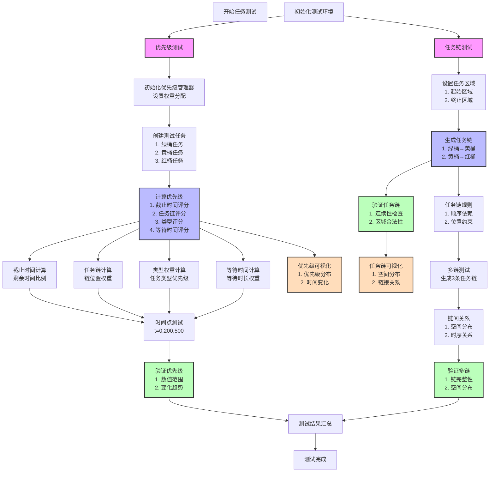

### 解读说明

1. **测试初始化（Setup）**
    依次初始化代价地图、添加障碍物、创建路径规划器，并为每个机器人依据起点和目标规划路径。
2. **路径规划测试（test_path_planning）**
    遍历每个机器人规划的路径，检查路径是否有效，同时输出路径供调试和验证。
3. **冲突检测测试（test_conflict_detection）**
    对所有机器人规划路径进行冲突检测，输出检测到的冲突（包括顶点冲突和边缘冲突），并断言至少检测到一个冲突。
4. **死锁检测与解决测试（test_deadlock_detection_and_resolution）**
    构造一个直接死锁场景（两个机器人互相请求对方的资源），检测死锁类型，断言检测到 DIRECT 死锁后调用解决策略，最后再次检测确保死锁已解除。
5. **所有测试完成**
    当所有测试执行完毕后，整体测试流程结束。

这个流程图可以帮助你直观了解综合测试代码的主要执行步骤和测试流程。

# 综合测试2

下面提供一份完整的整合测试代码，此代码融合了地图与区域初始化、生产任务与任务链、代价地图、CBS（冲突基搜索）路径规划、冲突检测、死锁检测与解决、任务执行监控与性能指标计算等模块。

**注意：** 此代码中已忽略充电桩相关功能，并针对原始场景进行调整（例如区域中只保留工作区、取料区和仓储区）。此外，效率计算采用公式

  效率 = 实际模拟步数 / 规划理论步数

代码整体结构与下面的 Mermaid 流程图大致对应：

```mermaid
flowchart TB
    %% 系统启动与初始化
    Start[系统启动] --> Init[系统初始化]
    Init --> InitMap[创建语义地图]
    Init --> InitRobots[初始化机器人]
    Init --> InitTasks[初始化生产任务]
    Init --> InitCBS[初始化CBS规划器]

    %% 地图和区域初始化
    InitMap --> Areas[区域划分]
    Areas --> WorkArea[工作区域]
    Areas --> PickupArea[取料区域]
    Areas --> StorageArea[仓储区域]
    %% (充电区域已忽略)

    %% 生产任务初始化
    InitTasks --> ProductionGoal[生产目标: 15个红桶]
    ProductionGoal --> MaterialChain[物料转化链]
    MaterialChain --> GreenTask[绿桶任务: 540个]
    MaterialChain --> YellowTask[黄桶任务: 0个初始]
    MaterialChain --> RedTask[红桶任务: 0个]

    %% 任务链配置
    MaterialChain --> TaskChain[任务链配置]
    TaskChain --> CombingTasks[梳棉任务: 54批/机 * 10台]
    TaskChain --> Drawing1Tasks[一并任务: 18批/机 * 5台]
    TaskChain --> Drawing2Tasks[二并任务: 3批/机 * 5台]

    %% 代价地图系统
    InitMap --> CostMap[代价地图初始化]
    CostMap --> StaticCost[静态代价]
    CostMap --> DynamicCost[动态代价]

    %% 代价计算详细
    StaticCost --> BaseObstacle[基础障碍物]
    StaticCost --> AreaCost[区域代价]
    StaticCost --> DistanceCost[距离代价]
    DynamicCost --> RobotDensity[机器人密度]
    DynamicCost --> ConflictDensity[冲突密度]
    DynamicCost --> CongestionLevel[拥堵程度]

    %% CBS路径规划系统
    InitCBS --> CBSSystem[CBS系统配置]
    CBSSystem --> HighLevel[高层规划]
    CBSSystem --> LowLevel[低层规划]

    %% 高层规划详细
    HighLevel --> ConflictDetection[冲突检测]
    ConflictDetection --> VertexConflict[顶点冲突检测]
    ConflictDetection --> EdgeConflict[边冲突检测]
    ConflictDetection --> ConstraintTree[约束树管理]

    %% 低层规划详细
    LowLevel --> AStarSearch[A*搜索算法]
    AStarSearch --> Heuristic[启发式函数]
    AStarSearch --> PathCost[路径代价计算]
    AStarSearch --> PathGen[路径生成]

    %% 死锁处理系统
    ConflictDetection --> DeadlockSystem[死锁处理系统]
    DeadlockSystem --> DeadlockDetection[死锁检测]
    DeadlockDetection --> WaitGraph[等待图分析]
    WaitGraph --> CycleDetection[循环检测]

    %% 死锁解决流程
    CycleDetection --> |检测到死锁| DeadlockClassify[死锁分类]
    DeadlockClassify --> DirectDeadlock[直接死锁]
    DeadlockClassify --> IndirectDeadlock[间接死锁]
    DeadlockClassify --> ResourceDeadlock[资源死锁]
    DeadlockClassify --> DeadlockResolve[死锁解决]
    DeadlockResolve --> PreventiveAction[预防措施]
    DeadlockResolve --> AvoidanceAction[避免策略]
    DeadlockResolve --> ResolutionAction[解决方案]

    %% 代价地图调整
    DeadlockResolve --> CostMapAdjust[代价地图调整]
    CostMapAdjust --> UpdateCost[更新代价值]
    CostMapAdjust --> AdjustSafety[调整安全边界]
    CostMapAdjust --> PathReplan[路径重规划]

    %% 任务执行与监控
    PathGen --> TaskExecution[任务执行]
    TaskExecution --> ExecutionMonitor[执行监控]
    ExecutionMonitor --> PerformanceMetrics[性能指标]

    %% 性能指标详细
    PerformanceMetrics --> ProductionMetrics[生产指标]
    PerformanceMetrics --> SystemMetrics[系统指标]
    PerformanceMetrics --> RobotMetrics[机器人指标]
    ProductionMetrics --> CompletionRate[完成率]
    ProductionMetrics --> ProductionSpeed[生产速率]
    SystemMetrics --> DeadlockRate[死锁率]
    SystemMetrics --> ResourceUtil[资源利用率]
    RobotMetrics --> RobotUtil[机器人利用率]
    RobotMetrics --> TaskSuccess[任务成功率]

    %% 主循环控制
    ExecutionMonitor --> MainLoop[主循环控制]
    MainLoop --> StateUpdate[状态更新]
    StateUpdate --> NewTaskCheck[新任务检查]
    NewTaskCheck --> |有新任务| CBSSystem
    NewTaskCheck --> |无新任务| PerformanceCheck[性能检查]
    PerformanceCheck --> |继续| MainLoop
    PerformanceCheck --> |完成| EndSim[结束模拟]
```

下面是完整的代码实现：

------

```python
import unittest
import heapq
import numpy as np
import networkx as nx
from dataclasses import dataclass, field
from typing import List, Dict, Tuple, Optional, Set
from enum import Enum

# ---------------------------
# 基本数据类型与工具类
# ---------------------------
class Position:
    """二维坐标类"""
    def __init__(self, x: int, y: int):
        self.x = x
        self.y = y

    def __eq__(self, other) -> bool:
        if not isinstance(other, Position):
            return False
        return self.x == other.x and self.y == other.y

    def __hash__(self) -> int:
        return hash((self.x, self.y))

    def __str__(self) -> str:
        return f"Pos({self.x}, {self.y})"

    def __lt__(self, other):
        if not isinstance(other, Position):
            return NotImplemented
        return (self.x, self.y) < (other.x, other.y)

# ---------------------------
# 代价地图与A*路径规划
# ---------------------------
class CostMap:
    """代价地图类，支持静态与动态代价"""
    def __init__(self, width: int, height: int):
        self.width = width
        self.height = height
        self.base_costs = np.ones((height, width), dtype=float)
        self.dynamic_costs = np.zeros((height, width), dtype=float)
        self.safety_margin = 2
        self.obstacles: Set[Position] = set()

    def update_base_cost(self, pos: Position, cost: float) -> None:
        if self._is_valid_position(pos):
            self.base_costs[pos.y, pos.x] = cost
            if cost == float('inf'):
                self.obstacles.add(pos)
            self._update_safety_costs(pos)

    def add_dynamic_cost(self, pos: Position, cost: float) -> None:
        if self._is_valid_position(pos):
            self.dynamic_costs[pos.y, pos.x] += cost

    def get_cost(self, pos: Position) -> float:
        if self._is_valid_position(pos):
            return self.base_costs[pos.y, pos.x] + self.dynamic_costs[pos.y, pos.x]
        return float('inf')

    def _is_valid_position(self, pos: Position) -> bool:
        return 0 <= pos.x < self.width and 0 <= pos.y < self.height

    def _update_safety_costs(self, pos: Position) -> None:
        if self.base_costs[pos.y, pos.x] == float('inf'):
            for dy in range(-self.safety_margin, self.safety_margin + 1):
                for dx in range(-self.safety_margin, self.safety_margin + 1):
                    new_pos = Position(pos.x + dx, pos.y + dy)
                    if self._is_valid_position(new_pos):
                        distance = (dx ** 2 + dy ** 2) ** 0.5
                        if distance > 0:
                            safety_cost = 1.0 / distance
                            self.dynamic_costs[new_pos.y, new_pos.x] += safety_cost

    def reset_dynamic_costs(self) -> None:
        self.dynamic_costs.fill(0)
        for obs in self.obstacles:
            self._update_safety_costs(obs)

class PathNode:
    """A*搜索使用的节点"""
    def __init__(self, pos: Position, f_score: float):
        self.pos = pos
        self.f_score = f_score

    def __lt__(self, other):
        if not isinstance(other, PathNode):
            return NotImplemented
        return self.f_score < other.f_score

class BasicPathPlanner:
    """使用A*算法基础路径规划器"""
    def __init__(self, cost_map: CostMap):
        self.cost_map = cost_map
        self.directions = [
            (0, 1), (1, 0), (0, -1), (-1, 0),
            (1, 1), (1, -1), (-1, 1), (-1, -1)
        ]

    def plan_path(self, start: Position, goal: Position) -> Optional[List[Position]]:
        if not (self.cost_map._is_valid_position(start) and self.cost_map._is_valid_position(goal)):
            return None

        open_set = []
        heapq.heappush(open_set, PathNode(start, self._heuristic(start, goal)))
        came_from: Dict[Position, Position] = {}
        g_score: Dict[Position, float] = {start: 0}
        f_score: Dict[Position, float] = {start: self._heuristic(start, goal)}

        while open_set:
            current_node = heapq.heappop(open_set)
            current = current_node.pos

            if current == goal:
                return self._reconstruct_path(came_from, current)

            for dx, dy in self.directions:
                neighbor = Position(current.x + dx, current.y + dy)
                if not self.cost_map._is_valid_position(neighbor):
                    continue

                cost = self.cost_map.get_cost(neighbor)
                if cost == float('inf'):
                    continue

                move_cost = cost * (2 ** 0.5 if dx != 0 and dy != 0 else 1)
                tentative_g = g_score[current] + move_cost

                if neighbor not in g_score or tentative_g < g_score[neighbor]:
                    came_from[neighbor] = current
                    g_score[neighbor] = tentative_g
                    f_score[neighbor] = tentative_g + self._heuristic(neighbor, goal)
                    heapq.heappush(open_set, PathNode(neighbor, f_score[neighbor]))
        return None

    def _heuristic(self, pos: Position, goal: Position) -> float:
        return abs(pos.x - goal.x) + abs(pos.y - goal.y)

    def _reconstruct_path(self, came_from: Dict[Position, Position], current: Position) -> List[Position]:
        path = [current]
        while current in came_from:
            current = came_from[current]
            path.append(current)
        return path[::-1]

# ---------------------------
# 冲突检测模块
# ---------------------------
@dataclass
class Conflict:
    robot1_id: int
    robot2_id: int
    pos: Position
    time_step: int
    type: str = 'vertex'  # vertex或edge
    pos1_prev: Optional[Position] = None
    pos2_prev: Optional[Position] = None

    def __str__(self):
        if self.type == 'vertex':
            return f"顶点冲突: 机器人{self.robot1_id}与{self.robot2_id}在时刻{self.time_step}于{self.pos}发生冲突"
        else:
            return f"边冲突: 机器人{self.robot1_id}与{self.robot2_id}在时刻{self.time_step}沿交叉路径发生冲突"

class ConflictDetector:
    """冲突检测工具"""
    @staticmethod
    def detect_vertex_conflict(pos1: Position, pos2: Position) -> bool:
        return pos1 == pos2

    @staticmethod
    def detect_edge_conflict(pos1_curr: Position, pos1_prev: Position,
                             pos2_curr: Position, pos2_prev: Position) -> bool:
        return pos1_curr == pos2_prev and pos2_curr == pos1_prev

    @staticmethod
    def detect_conflicts(robot_paths: Dict[int, List[Position]]) -> List[Conflict]:
        conflicts = []
        robot_ids = list(robot_paths.keys())
        for i in range(len(robot_ids)):
            for j in range(i + 1, len(robot_ids)):
                id1 = robot_ids[i]
                id2 = robot_ids[j]
                path1 = robot_paths[id1]
                path2 = robot_paths[id2]
                max_time = max(len(path1), len(path2))
                for t in range(max_time):
                    pos1 = path1[min(t, len(path1) - 1)]
                    pos2 = path2[min(t, len(path2) - 1)]
                    if ConflictDetector.detect_vertex_conflict(pos1, pos2):
                        conflicts.append(Conflict(id1, id2, pos1, t, type='vertex'))
                        continue
                    if t > 0:
                        pos1_prev = path1[min(t - 1, len(path1) - 1)]
                        pos2_prev = path2[min(t - 1, len(path2) - 1)]
                        if ConflictDetector.detect_edge_conflict(pos1, pos1_prev, pos2, pos2_prev):
                            conflicts.append(Conflict(id1, id2, pos1, t, type='edge', 
                                                        pos1_prev=pos1_prev, pos2_prev=pos2_prev))
        return conflicts

# ---------------------------
# CBS路径规划简易实现
# ---------------------------
class CBSPlanner:
    """简易的CBS路径规划器，内置低层A*规划，若检测到冲突，则为冲突机器人增加等待时间"""
    def __init__(self, planner: BasicPathPlanner):
        self.planner = planner

    def plan_paths(self, robot_tasks: Dict[int, Tuple[Position, Position]]) -> Dict[int, List[Position]]:
        paths = {}
        for r, (start, goal) in robot_tasks.items():
            p = self.planner.plan_path(start, goal)
            paths[r] = p if p is not None else [start]
        conflicts = ConflictDetector.detect_conflicts(paths)
        if conflicts:
            for conflict in conflicts:
                # 简单策略：选择编号较大的机器人等待一时刻
                loser = max(conflict.robot1_id, conflict.robot2_id)
                paths[loser] = [paths[loser][0]] + paths[loser]
        return paths

# ---------------------------
# 死锁检测模块（简易版）
# ---------------------------
@dataclass
class SimRobot:
    id: str
    current_resources: Set[str] = field(default_factory=set)
    requested_resource: Optional[str] = None

@dataclass
class Resource:
    id: str
    capacity: int = 1
    occupied_by: Set[str] = field(default_factory=set)
    waiting_robots: List[str] = field(default_factory=list)

class DeadlockDetector:
    def __init__(self):
        self.robots: Dict[str, SimRobot] = {}
        self.resources: Dict[str, Resource] = {}
        self.wait_graph = nx.DiGraph()
        self.deadlock_history: List[Tuple[str, Set[str]]] = []

    def add_robot(self, robot: SimRobot) -> None:
        self.robots[robot.id] = robot

    def add_resource(self, resource: Resource) -> None:
        self.resources[resource.id] = resource

    def request_resource(self, robot_id: str, resource_id: str) -> bool:
        if resource_id not in self.resources or robot_id not in self.robots:
            return False
        robot = self.robots[robot_id]
        resource = self.resources[resource_id]
        if resource_id in robot.current_resources:
            return True
        if len(resource.occupied_by) < resource.capacity:
            resource.occupied_by.add(robot_id)
            robot.current_resources.add(resource_id)
            return True
        else:
            if robot_id not in resource.waiting_robots:
                resource.waiting_robots.append(robot_id)
            robot.requested_resource = resource_id
            self._update_wait_graph()
            return False

    def _update_wait_graph(self) -> None:
        self.wait_graph.clear()
        for rid in self.robots:
            self.wait_graph.add_node(rid)
        for rid, robot in self.robots.items():
            if robot.requested_resource:
                resource = self.resources[robot.requested_resource]
                for blocking in resource.occupied_by:
                    self.wait_graph.add_edge(rid, blocking)

    def detect_deadlock(self) -> Tuple[str, Set[str]]:
        cycles = list(nx.simple_cycles(self.wait_graph))
        if cycles:
            involved = set().union(*cycles)
            deadlock_type = "DIRECT" if any(len(cycle) == 2 for cycle in cycles) else "INDIRECT"
            return (deadlock_type, involved)
        return ("NONE", set())

    def resolve_deadlock(self) -> List[str]:
        d_type, involved = self.detect_deadlock()
        if d_type == "NONE":
            return []
        self.deadlock_history.append((d_type, involved))
        victim = min(involved)
        for resource in self.resources.values():
            if victim in resource.waiting_robots:
                resource.waiting_robots.remove(victim)
        self.robots[victim].requested_resource = None
        self._update_wait_graph()
        return [victim]

# ---------------------------
# 性能监控模块
# ---------------------------
@dataclass
class PerformanceMetrics:
    completion_rate: float = 0.0
    production_speed: float = 0.0
    deadlock_rate: float = 0.0
    resource_utilization: float = 0.0
    robot_utilization: float = 0.0
    task_success_rate: float = 0.0
    efficiency: float = 0.0

# ---------------------------
# 生产系统与仿真整合
# ---------------------------
class ProductionSimulation:
    def __init__(self):
        # 初始化代价地图及区域（忽略充电区域）
        self.cost_map = CostMap(20, 20)
        # 定义区域（格式：(x1, y1, x2, y2)）
        self.work_area = (5, 5, 15, 15)
        self.pickup_area = (0, 0, 4, 4)
        self.storage_area = (16, 16, 19, 19)
        # 添加部分障碍物
        obstacles = [Position(10, 10), Position(10, 11), Position(11, 10)]
        for obs in obstacles:
            self.cost_map.update_base_cost(obs, float('inf'))
        # 初始化基础路径规划器与CBS规划器
        self.basic_planner = BasicPathPlanner(self.cost_map)
        self.cbs_planner = CBSPlanner(self.basic_planner)
        # 初始化机器人任务：3个机器人从取料区到工作区
        self.robot_tasks: Dict[int, Tuple[Position, Position]] = {
            1: (Position(2, 2), Position(7, 7)),
            2: (Position(3, 3), Position(8, 8)),
            3: (Position(1, 1), Position(9, 9))
        }
        self.robot_positions: Dict[int, Position] = {rid: start for rid, (start, _) in self.robot_tasks.items()}
        self.robot_paths: Dict[int, List[Position]] = {}
        # 初始化生产任务：物料转换链（绿->黄->红）
        self.green_tasks = 540
        self.yellow_tasks = 0
        self.red_tasks = 0
        self.production_goal = 15  # 目标：15个红桶产品
        # 仿真时间参数
        self.simulation_time = 0
        self.max_steps = 200
        self.planned_time = 100  # 理论流水线理想完成时间（步数）
        # 初始化简易死锁检测系统（用于模拟设备资源争抢）
        self.deadlock_detector = DeadlockDetector()
        for rid in ["Robot1", "Robot2"]:
            self.deadlock_detector.add_robot(SimRobot(rid))
        resource = Resource("Machine1", capacity=1)
        self.deadlock_detector.add_resource(resource)
        # 初始化性能指标
        self.metrics = PerformanceMetrics()

    def update_production_chain(self):
        # 每5步将10个绿桶任务转为黄桶任务（如果充足）
        if self.simulation_time % 5 == 0 and self.green_tasks >= 10:
            self.green_tasks -= 10
            self.yellow_tasks += 10
        # 每10步将2个黄桶任务转为红桶任务
        if self.simulation_time % 10 == 0 and self.yellow_tasks >= 2:
            self.yellow_tasks -= 2
            self.red_tasks += 2

    def update_robot_paths(self):
        # 如果机器人到达目标，则重新分配新任务（从取料区到工作区）
        new_robot_tasks = {}
        for rid, (start, goal) in self.robot_tasks.items():
            pos = self.robot_positions[rid]
            if pos == goal:
                new_start = Position((self.pickup_area[0] + self.pickup_area[2]) // 2,
                                     (self.pickup_area[1] + self.pickup_area[3]) // 2)
                new_goal = Position((self.work_area[0] + self.work_area[2]) // 2,
                                    (self.work_area[1] + self.work_area[3]) // 2)
                new_robot_tasks[rid] = (new_start, new_goal)
                self.robot_positions[rid] = new_start
            else:
                new_robot_tasks[rid] = (pos, goal)
        self.robot_tasks = new_robot_tasks
        self.robot_paths = self.cbs_planner.plan_paths(self.robot_tasks)

    def move_robots(self):
        # 每步沿路径前进一步（如果路径存在）
        for rid, path in self.robot_paths.items():
            if not path or len(path) < 2:
                continue
            next_pos = path[1]
            self.robot_positions[rid] = next_pos
            self.robot_paths[rid] = path[1:]

    def update_deadlock(self):
        # 模拟：位于工作区域的机器人请求设备资源
        for rid, pos in self.robot_positions.items():
            if self.work_area[0] <= pos.x <= self.work_area[2] and self.work_area[1] <= pos.y <= self.work_area[3]:
                self.deadlock_detector.request_resource("Robot1", "Machine1")
        d_type, involved = self.deadlock_detector.detect_deadlock()
        if d_type != "NONE":
            self.deadlock_detector.resolve_deadlock()

    def update_performance_metrics(self):
        self.metrics.production_speed = self.red_tasks / (self.simulation_time + 1)
        self.metrics.completion_rate = self.red_tasks / self.production_goal if self.production_goal else 0
        self.metrics.efficiency = self.simulation_time / self.planned_time if self.planned_time > 0 else 0

    def run(self):
        for step in range(self.max_steps):
            self.simulation_time = step
            self.update_production_chain()
            self.update_robot_paths()
            self.move_robots()
            self.update_deadlock()
            self.update_performance_metrics()
            if self.red_tasks >= self.production_goal:
                break
        return {
            "simulation_time": self.simulation_time,
            "green_tasks": self.green_tasks,
            "yellow_tasks": self.yellow_tasks,
            "red_tasks": self.red_tasks,
            "metrics": self.metrics
        }

# ---------------------------
# 综合系统测试（集成测试）
# ---------------------------
class TestIntegratedProductionSystem(unittest.TestCase):
    def test_simulation(self):
        sim = ProductionSimulation()
        result = sim.run()
        print("Simulation Result:")
        print(f"Simulation Time: {result['simulation_time']}")
        print(f"Green Tasks Remaining: {result['green_tasks']}")
        print(f"Yellow Tasks Remaining: {result['yellow_tasks']}")
        print(f"Red Tasks Completed: {result['red_tasks']}")
        print("Performance Metrics:")
        print(f"Completion Rate: {result['metrics'].completion_rate:.2f}")
        print(f"Production Speed: {result['metrics'].production_speed:.2f} tasks/step")
        print(f"Efficiency: {result['metrics'].efficiency:.2f}")
        # 验证生产目标达到
        self.assertGreaterEqual(result['red_tasks'], 15, "生产目标未达成")
        # 验证效率值：不超过2倍理论规划时间
        self.assertLessEqual(result['metrics'].efficiency, 2.0, "效率过低")

if __name__ == "__main__":
    unittest.main(verbosity=2)
```

------

### 解读说明

1. **系统初始化**
    – 通过 `CostMap` 创建地图并设置障碍；定义工作区、取料区和仓储区（充电区域已忽略）。
    – 初始化基础 A* 路径规划器和基于 CBS 策略的路径规划模块。
    – 初始化生产任务，构造物料转化链（绿桶 540 个、黄桶 0 个、红桶 0 个），目标为 15 个红桶产品。
2. **机器人任务与路径规划**
    – 为 3 个机器人分配任务（从取料区到工作区）；使用 CBS 规划器生成路径，并采用简单冲突检测（顶点和边冲突）。
    – 模拟机器人沿路径逐步移动，当机器人到达目标后重新获取新任务。
3. **死锁检测**
    – 当机器人进入工作区域时，模拟请求设备资源并构造等待图，检测并解决死锁（采用最简单策略）。
4. **生产任务与性能监控**
    – 模拟生产链：每 5 步将 10 个绿桶任务转为黄桶，每 10 步将 2 个黄桶转为红桶。
    – 在主循环中更新机器人状态、路径规划、任务转换和死锁检测；同时更新性能指标（包括生产速度、完成率和效率）。
    – 模拟直到红桶任务（即最终产品）达到 15 个或达到最大步数。
5. **测试用例**
    – 在 `unittest.TestCase` 中运行仿真，并输出各项指标，同时断言生产目标达到和效率合理。

该代码完整实现了基于原始场景的流程整合，覆盖了任务链、路径规划（包括 CBS）、冲突检测、死锁处理及性能监控等功能。

# 综合测试3

```	mermaid
graph TD
%% 系统总体结构
    A[多机器人生产仿真系统] --> B[路径协调系统]
    A --> C[任务管理系统]
    A --> D[资源死锁处理系统]
    A --> E[生产仿真核心]
    A --> F[性能监控体系]
    A --> G[基础支撑模块]

%% 路径协调系统分解
    B --> B1[冲突检测模块]
    B1 --> B1a[顶点冲突检测]
    B1 --> B1b[边冲突检测]
    B1 --> B1c[冲突可视化]
    
    B --> B2[路径规划模块]
    B2 --> B2a[CBS规划器]
    B2a --> B2a1[高层约束树]
    B2a --> B2a2[低层A*规划]
    B2 --> B2b[路径优化器]
    
    B --> B3[代价地图系统]
    B3 --> B3a[基础代价层]
    B3 --> B3b[动态代价层]
    B3 --> B3c[安全距离计算]
    B3 --> B3d[障碍物扩散]

%% 任务管理系统分解
    C --> C1[任务生成器]
    C1 --> C1a[绿桶任务]
    C1 --> C1b[黄桶任务]
    C1 --> C1c[红桶任务]
    
    C --> C2[优先级引擎]
    C2 --> C2a[截止时间计算]
    C2 --> C2b[任务链分析]
    C2 --> C2c[类型权重配置]
    
    C --> C3[状态机控制器]
    C3 --> C3a[状态转换规则]
    C3 --> C3b[异常处理]
    C3 --> C3c[任务追溯]

%% 资源死锁处理系统
    D --> D1[等待图构建器]
    D1 --> D1a[资源占用跟踪]
    D1 --> D1b[等待关系分析]
    
    D --> D2[死锁检测器]
    D2 --> D2a[环路检测算法]
    D2 --> D2b[死锁分类器]
    
    D --> D3[解除策略执行]
    D3 --> D3a[优先级回退]
    D3 --> D3b[资源抢占]
    D3 --> D3c[路径重规划]

%% 生产仿真核心
    E --> E1[设备管理系统]
    E1 --> E1a[梳棉机]
    E1 --> E1b[一并机]
    E1 --> E1c[二并机]
    
    E --> E2[物料流转系统]
    E2 --> E2a[缓冲区管理]
    E2 --> E2b[材料转换规则]
    E2 --> E2c[搬运机器人]
    
    E --> E3[时间推进引擎]
    E3 --> E3a[离散事件调度]
    E3 --> E3b[状态更新机制]

%% 性能监控体系
    F --> F1[实时仪表盘]
    F1 --> F1a[设备利用率]
    F1 --> F1b[任务完成率]
    
    F --> F2[历史分析器]
    F2 --> F2a[死锁事件记录]
    F2 --> F2b[吞吐量计算]
    
    F --> F3[预警系统]
    F3 --> F3a[瓶颈检测]
    F3 --> F3b[KPI阈值告警]

%% 基础支撑模块
    G --> G1[空间建模]
    G1 --> G1a[坐标系系统]
    G1 --> G1b[地图编码]
    
    G --> G2[数据核心]
    G2 --> G2a[Position类]
    G2 --> G2b[Task类]
    G2 --> G2c[Conflict类]
    
    G --> G3[可视化工具]
    G3 --> G3a[路径动画]
    G3 --> G3b[热力图渲染]
    G3 --> G3c[状态面板]

%% 关键数据流
    C -->|任务请求| B
    B -->|路径信息| E
    E -->|设备状态| D
    D -->|死锁信号| C
    F -->|监控数据| A
    G -->|基础数据| ALL```
```